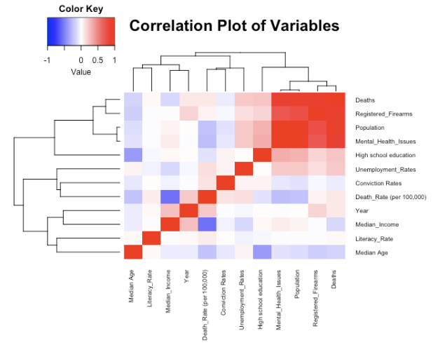
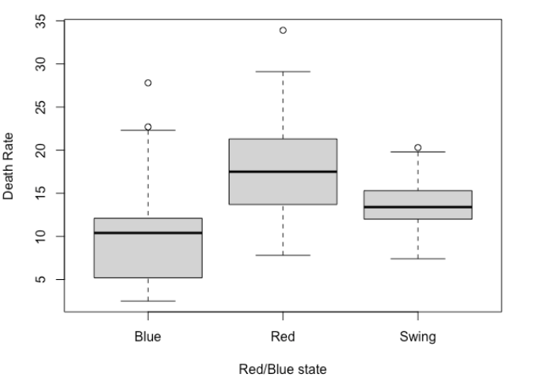

# Gun Violence Prediction Using Regression Analysis

## Introduction

The context of this project revolves around explaining gun violence death rates in the United States. We aim to further the research “Exploring Gun Violence” (Jonathan et. al,2019) which tried to find relationships between gun violence in America, the average number of mental health issues in states, and the strictness of state gun laws.  
We aim to employ regression analysis that effectively captures the relationships between various factors and gun violence. 
The variables we have considered include the unemployment rate, registered firearms, literacy rate, state conviction rates, median age, mental health cases, median income, and the political affiliation of the state (red/blue/swing). We also look at whether there is an increasing trend in the deaths per 100,00 over time (here on considered as the Death Rate). Through this project, we seek to practice and demonstrate regression analysis methodologies learned during the course, including exploratory data analysis, Correlation, ANOVA, Regression Modeling, and Goodness of Fit Analysis.

## Problem Statement

Given the factors in the model, we have the following objectives:
Can the gun violence death rates (response variable) in a state be explained by the various socio-economic, political, and education-based factors in the state?
Provide a regression model that can explain the gun violence death rates in a state, given the features in the dataset.
Find the variables with the most explanatory power about gun violence death rates, and analyze their values and significance.

## Data Description

For the data, we used the US Census website and the CDC website to extract state and year-wise data. 
We extracted mental health data from the annual reports published by Mental Health America,

The dataset consists of 350 data points within the period of 2015-2021. Below is the list of dependent and independent variables.

### Dependent variable
- Deaths/Deaths per 100k due to gun violence
### Independent variables
#### Quantitative
- Number of mental health issues/100k annually
- Unemployment rates
- Median Age
- Literacy Rate
- State conviction rates
- Median Income (in $)
- Number of high school-educated youth
- Number of registered firearms (per capita)
- Year
#### Qualitative
- Type of state(red/blue/swing)

## Data Cleaning and EDA

- Looking into NA and extreme values
- Interpolation of missing high school-educated youth values for 2020 as the mean of 2021 and 2019

 

## Results and Conclusions
- Achieved R^2 score of 0.76 on Multiple Linear Regression Model after Forward Stepwise Regression
- Performed Goodness of Fit Analysis and Outlier Detection using Cook's Distance
- State Type, Year, registered firearms, Unemployment Rates, Mental Health Issues, Median Age, and high school education are all significant estimators for gun violence-related deaths in America
- While mental health has a negative coefficient in our final model, we find that it is a very small coefficient and does not indicate causality in the case of our study
- When yearly data is analyzed mental health is not a significant estimator.Consistent with the initial study
- Poisson estimators are not a good metric to estimate gun violence-related deaths based on the independent variables we have chosen in this study.

## Future Scope
- New data points and variables to improve variability in the deaths due to gun violence incidents
- Further analysis of outliers, including variable ranges
- Finding a better estimator than Poisson to predict the death rates
- Testing of predictive power using train test split
- Understanding why Mental Health is consistently coming out to be insignificant in these studies

